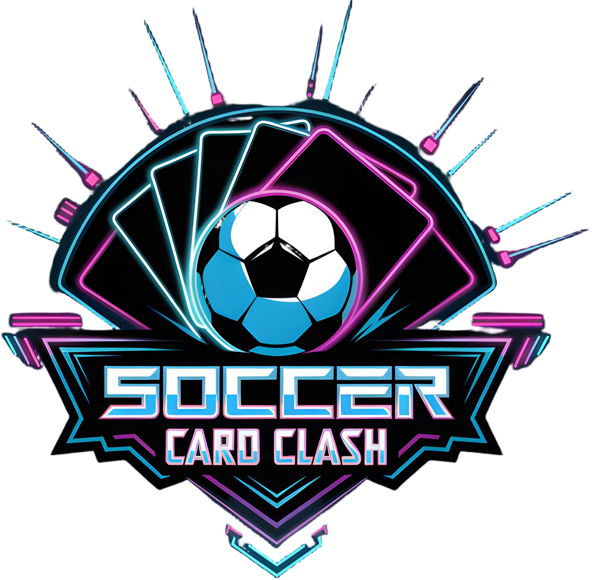
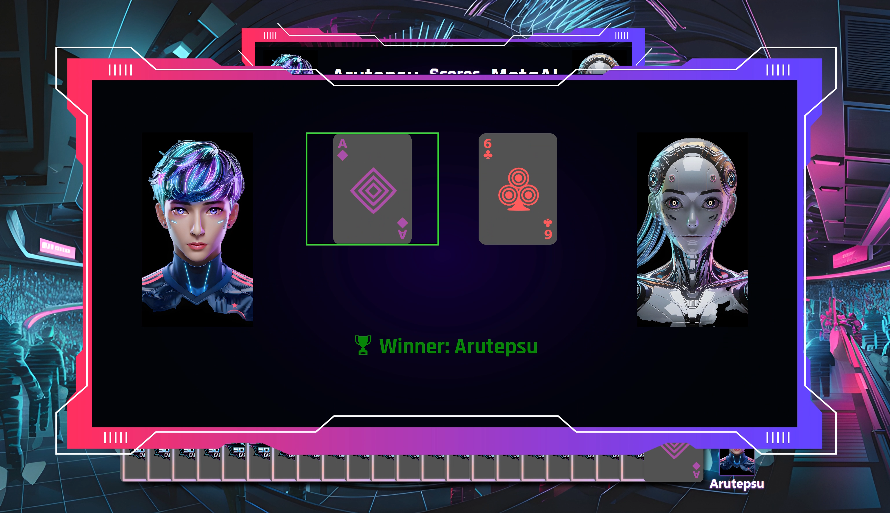

---
# Soccer Card Clash
An unofficial Scala version of the Soccer Card Clash game for Software Engineering classes at HTWG Konstanz.

* Soccer Card Clash is a fast-paced, strategic 2-player card game where soccer meets tactical mind games.
* Outmaneuver your opponent with clever attacks, boosts, and hand manipulation to score goals and win the match.
---
### Game Overview
* Each player controls a hand of soccer-themed player cards.
* Take turns as the attacker or defender.
* Outsmart your opponent by choosing the right action at the right time.
* Score goals by breaking through all defenders and beating the goalkeeper.

[Read Full Game Rules](src/main/resources/docs/GAMERULES.md)

---

### Project Status

-Completed-brightgreen)

<h3>Demo Game Creation with AI &nbsp;&nbsp;&nbsp;&nbsp;|&nbsp;&nbsp;&nbsp;&nbsp; Demo Gameplay</h3>

  
  

### Screenshots

_Developed by [Arutepsu](httzps://github.com/arutepsu)_