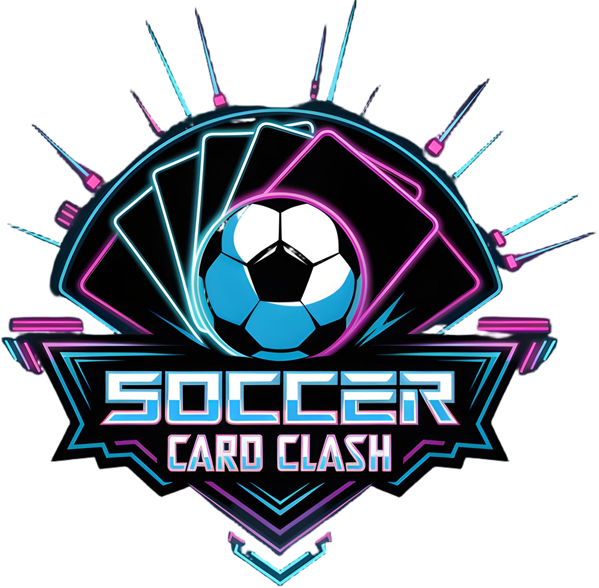
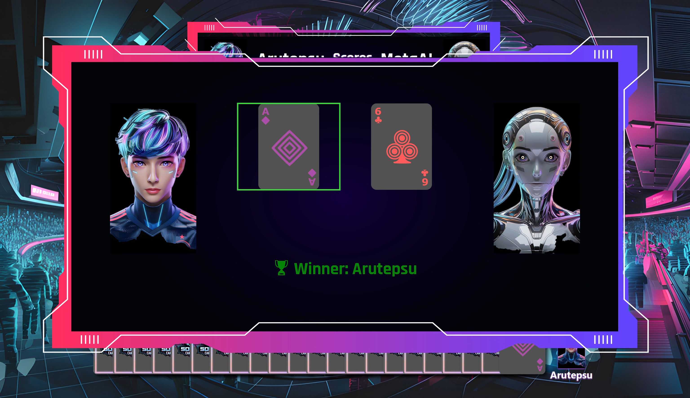

<p align="center">

</p>

---

[](https://coveralls.io/github/arutepsu/Soccer-Card-Clash?branch=main)
[](https://app.codacy.com/gh/arutepsu/Soccer-Card-Clash/dashboard)


---
# Soccer Card Clash

An unofficial Scala version of the Soccer Card Clash game for Software Engineering classes at 
Konstanz University of Applied Sciences.

🌐 **Web Version:** [Soccer-Card-Clash-Web](https://github.com/arutepsu/Soccer-Card-Clash-Web)

* 🎮 Soccer Card Clash is a fast-paced, strategic 2-player card game where soccer meets tactical mind games.
* 🧠 Outmaneuver your opponent with clever attacks, boosts, and hand manipulation to score goals and win the match.

---
## ⚽ Game Overview
* 🃏 Each player controls a hand of soccer-themed player cards.
* 🔄 Take turns as the attacker or defender.
* 🧠 Outsmart your opponent by choosing the right action at the right time.
* 🎯 Score goals by breaking through all defenders and beating the goalkeeper.

### 📖[Read Full Game Rules](src/main/resources/docs/GAMERULES.md)

---
<h2 style="text-align: center;">▶️ Demo Gameplay</h2>
<div style="display: flex; gap: 0px;">
  
  
</div>

---
## ✨ Features
### 🤖 Singleplayer Mode
Play against various AI opponents, each with its own unique strategy and behavior.

### 🧠 Multiple AI Strategies
Challenge AIs with different difficulty levels and tactics — from cautious defenders to aggressive attackers.

### 🤝 Multiplayer Mode
Play with friends in local multiplayer matches.

### 🎨 Unique Cyberpunk Design
Dive into a cyberpunk-inspired world with bold visuals, neon effects, and a futuristic interface.

### ⚔️ Strategic Gameplay
Mix and match actions like Swap, Boost, and Double Attack to outsmart your opponent.

--- 

## 🧱 Architecture
This game is built using the Model-View-Controller (MVC) architectural pattern, ensuring a clean separation of concerns and modularity.

### 🧠 Model

The **model** contains the immutable core logic of the game:

- Card logic, roles, scores, and game state transitions
- Built with immutability for safe concurrency and functional testing
- Implements key design patterns like **Memento**, **Strategy**, and **State**

### 🖼️ View

Two synchronized views allow flexible interaction:

- 🖥️ **GUI** (ScalaFX) – interactive and animated graphical interface
- 📝 **TUI** – text-based interface ideal for fast testing and debugging
- Both views act as **observers** and update automatically via event dispatching

### 🎮 Controller

The **controller** coordinates between user input and model logic:

- Translates actions into executable **commands**
- Applies changes using an **UndoManager** and updates a shared `GameContext`
- Forwards emitted events to registered observers using a **Mediator** (`EventDispatcher`)

---

### 📐 Design Patterns

This project applies several classic design patterns to ensure **clean architecture**, **testability**, and **flexible extensibility** across the model, controller, and view layers.

### 👉 [See full documentation here](src/main/resources/docs/PATTERNS.md)

---
## 💻 Technologies Used


---

## 📸 Screenshots





---

# 🐞 Current Bugs to Fix

- [ ] Fix AI players to consistently continue attacking instead of stopping or idling; add fallback logic when they halt.
- [ ] Fix card comparison display when the card values are the same.
- [ ] Replace the Queen of Spades image with a proper `.png` version.
- [ ] Fix Docker.

---

# 🚀 Getting Started
Want to jump into the game? Just clone this repository and launch it locally:

```bash
git clone https://github.com/arutepsu/Soccer-Card-Clash.git
cd soccer-card-clash
```
# 🛠️ How to Use
This is a standard sbt project. Here are the most common commands:

### 🔨 Compile the project
```bash
sbt compile
```
### 🎮 Start the game
```bash
sbt run
```
### 🧪 Run tests
```bash
sbt test
```

---

### 📫 Get in Touch
Questions? Feedback? Found a bug?
Feel free to reach out via email: arutepsu@gmail.com
or open an issue right here on GitHub.

Let the Card Clash begin! ⚽🔥⚔️

---

#### _👨‍💻 Developed with passion by_ [Arutepsu](httzps://github.com/arutepsu)

---