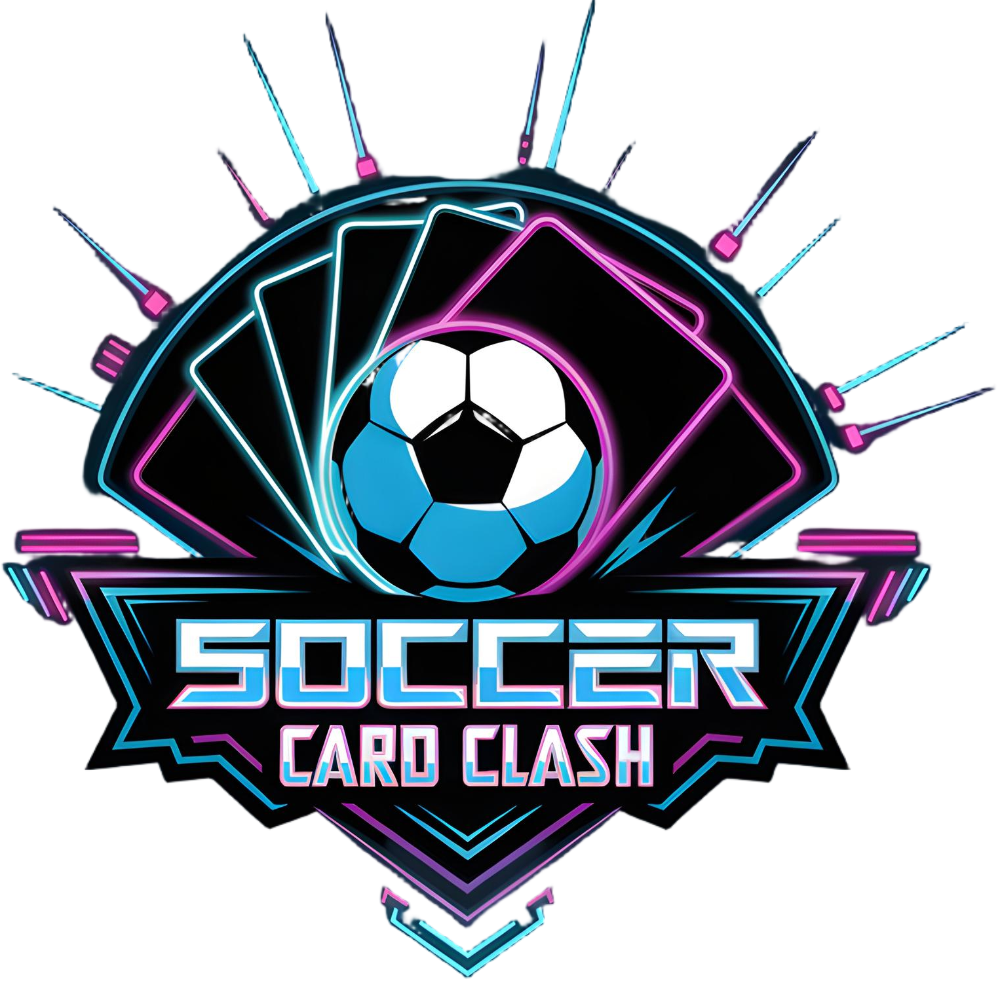

  

# 📐 Design Patterns Overview

---
## 🧠 GameState – Core Game Snapshot

### ☑️ Implemented Patterns: Memento • Delegation • State

#### 💡 Overview

The GameState is the heart of the game's logic — a snapshot of the current game round. It encapsulates player roles,
scores, and card allocations using immutable components.

Each modification (e.g., scoring a goal or switching roles) results in a new GameState,
preserving functional purity and enabling safe undo/redo.

## 🧩 UML Diagram

### 🔄 Memento Pattern

| **Role**   | **Class**                                                                                      | **Description**                                  |
| ---------- |------------------------------------------------------------------------------------------------| ------------------------------------------------ |
| Originator | [`GameState`](../../scala/de/htwg/se/soccercardclash/model/gameComponent/base/GameState.scala) | Captures/restores its internal state             |
| Memento    | [`GameStateMemento`](../../scala/de/htwg/se/soccercardclash/util/GameStateMemento.scala)       | Stores the state of roles, scores, and cards     |
| Caretaker  | External (e.g. undo stack)                                                                     | Holds mementos externally without modifying them |

This supports undo/redo, replays, and safe time travel.

### 📦 Delegation Pattern
| **Responsibility** | **Delegated To**                                                                                     | **Example Methods**                             |
| ------------------ |------------------------------------------------------------------------------------------------------| ----------------------------------------------- |
| Role management    | [`IRoles`](../../scala/de/htwg/se/soccercardclash/model/gameComponent/components/Roles.scala)        | `attacker()`, `defender()`, `switchRoles()`     |
| Score tracking     | [`IScores`](../../scala/de/htwg/se/soccercardclash/model/gameComponent/components/Scores.scala)      | `scoreGoal()`, `newScore()`, `getScore()`       |
| Card handling      | [`IGameCards`](../../scala/de/htwg/se/soccercardclash/model/gameComponent/components/GameCards.scala) | `getPlayerHand()`, `newPlayerDefenders()`, etc. |

### 🌀 State Pattern (Conceptual)
| **Element**                                                                                    | **Description**                                                                              |
|------------------------------------------------------------------------------------------------| -------------------------------------------------------------------------------------------- |
| [`GameState`](../../scala/de/htwg/se/soccercardclash/model/gameComponent/base/GameState.scala) | Represents a snapshot of the current game state                                              |
| Transition Method                                                                              | Transitions to a new state using `newGameCards`, `newScores`, `newRoles`                     |
| Result                                                                                         | Each call returns a new immutable `GameState`, simulating pure, functional state transitions |

---
## 🧠 Action Strategies – Flexible Game Behavior
### ☑️ Implemented Pattern: Strategy
#### 💡 Overview
Different in-game actions (attacks, boosts, swaps) follow customizable rules — yet share a common interface. 
The IActionStrategy defines this interface, and each action type (e.g. SingleAttackStrategy, DefenderBoostStrategy) 
provides a concrete implementation.

This is a classic use of the Strategy Pattern, promoting open/closed design and behavioral decoupling.

## 🧩 UML Diagram

### 🧠 Strategy Pattern

| **Component**                                                                                                                                 | **Role**                                                             |
|-----------------------------------------------------------------------------------------------------------------------------------------------|----------------------------------------------------------------------|
| [`IActionStrategy`](../../scala/de/htwg/se/soccercardclash/model/gameComponent/action/strategy/trigger/IActionStrategy.scala)                 | Strategy interface – defines the `execute()` method                  |
| [`SingleAttackStrategy`](../../scala/de/htwg/se/soccercardclash/model/gameComponent/action/strategy/trigger/attack/SingleAttackStrategy.scala) | Concrete strategy – performs a basic attack                          |
| [`DoubleAttackStrategy`](../../scala/de/htwg/se/soccercardclash/model/gameComponent/action/strategy/trigger/attack/DoubleAttackStrategy.scala) | Concrete strategy – performs a double-card attack                    |
| [`DefenderBoostStrategy`](../../scala/de/htwg/se/soccercardclash/model/gameComponent/action/strategy/trigger/boost/DefenderBoostStrategy.scala) | Concrete strategy – boosts a defender card                           |
| [`GoalkeeperBoostStrategy`](../../scala/de/htwg/se/soccercardclash/model/gameComponent/action/strategy/trigger/boost/GoalkeeperBoostStrategy.scala) | Concrete strategy – boosts a goalkeeper card                         |
| [`RegularSwapStrategy`](../../scala/de/htwg/se/soccercardclash/model/gameComponent/action/strategy/trigger/swap/RegularSwapStrategy.scala) | Concrete strategy – swaps last hand card with chosen hand card index |
| [`ReverseSwapStrategy`](../../scala/de/htwg/se/soccercardclash/model/gameComponent/action/strategy/trigger/swap/ReverseSwapStrategy.scala) | Concrete strategy – reverses the hand cards indexes                  |

Each action is modular, testable, and swap-friendly at runtime, enabling both player and AI decision logic to reuse the
same interface.

---
## 🔗 Action Handler Chain – Processing Dynamic Actions
### ☑️ Implemented Pattern: Chain of Responsibility
#### 💡 Overview
In the game logic, actions like attacks, boosts, or swaps are handled dynamically based on their type. 
Instead of using massive if-else chains or type casting, we use the Chain of Responsibility Pattern
to pass an action through a chain of handlers.

Each handler checks if it can execute the given IActionStrategy. 
If it can't, it delegates to the next handler. This keeps the system extensible, decoupled, and open/closed.

## 🧩 UML Diagram

### 🔗 Chain of Responsibility Pattern
| **Component**                                                                                                                       | **Role**                                                                                       |
|-------------------------------------------------------------------------------------------------------------------------------------| ---------------------------------------------------------------------------------------------- |
| [`IActionHandler`](../../scala/de/htwg/se/soccercardclash/model/gameComponent/action/strategy/executor/ActionHandler.scala)         | Handler interface – defines `setNext` and `handle` methods                                     |
| [`ActionHandler`](../../scala/de/htwg/se/soccercardclash/model/gameComponent/action/strategy/executor/ActionHandler.scala)          | Abstract base – holds reference to `nextHandler` and delegates if current handler can't handle |
| [`StrategyHandler`](../../scala/de/htwg/se/soccercardclash/model/gameComponent/action/strategy/executor/StrategyHandler.scala)      | Concrete handler – uses a specific `StrategyExecutor` to process matching strategies           |
| [`StrategyExecutor`](../../scala/de/htwg/se/soccercardclash/model/gameComponent/action/strategy/executor/StrategyExecutor.scala)    | Executes a specific strategy type after `canHandle()` check                                    |
| [`HandlerChainFactory`](../../scala/de/htwg/se/soccercardclash/model/gameComponent/action/strategy/executor/StrategyHandler.scala)  | Creates the full handler chain from all known strategy handlers                                |

This pattern allows extensible support for new strategies without changing existing logic.

### 🔄 Example Flow
1. A player triggers an IActionStrategy (e.g., DoubleAttackStrategy)
2. The first StrategyHandler checks if its StrategyExecutor can handle it.
3. If not, it calls handleNext(...) -> passes the request to the next handler.
4. When a handler matches, it executes the strategy and returns the updated game state + events.

--- 

## 🎮 Game Commands – Encapsulating Player Actions
### ☑️ Implemented Pattern: Command
#### 💡 Overview
Game actions (like attacking or boosting) are encapsulated as command objects. Each command implements a common interface and can be executed independently, enabling:

✅ Undo/redo mechanisms

✅ Action queuing

✅ Replay of moves

✅ Decoupled control logic

This is a textbook use of the Command Pattern, allowing the controller to issue actions without knowing the internal details of how they are carried out.

## 🧩 UML Diagram

###  🧠 Command Pattern
| **Component**                                                                                                                                                    | **Role**                                                                        |
|------------------------------------------------------------------------------------------------------------------------------------------------------------------| ------------------------------------------------------------------------------- |
| [`ICommand`](../../scala/de/htwg/se/soccercardclash/controller/command/ICommand.scala)                                                                           | Core command interface with an `execute` method                                 |
| [`ActionCommand`](../../scala/de/htwg/se/soccercardclash/controller/command/actionCommandTypes/action/ActionCommand.scala)                                       | Abstract base class providing default logic and delegation                      |
| [`SingleAttackActionCommand`](../../scala/de/htwg/se/soccercardclash/controller/command/actionCommandTypes/attackActionCommands/SingleAttackActionCommand.scala) | Concrete command – performs a single attack on a specified defender index       |
| [`IActionExecutor`](../../scala/de/htwg/se/soccercardclash/model/gameComponent/action/manager/ActionExecutor.scala)                                              | Executes the given strategy and returns a `CommandResult`                       |
| [`CommandResult`](../../scala/de/htwg/se/soccercardclash/controller/command/ICommand.scala)                                                                      | Result container with updated `IGameState`, success flag, and observable events |

### ⚙️ Execution Flow

1. The controller creates a concrete command (e.g., `SingleAttackActionCommand`), setting required parameters like the defender index.
2. It calls `command.execute(currentState)`.
3. The command internally calls `executeAction(...)`, which:
    - Delegates to an `IActionExecutor`
    - Applies the relevant strategy
    - Returns a `CommandResult` with:
        - the new `IGameState`
        - a success flag
        - a list of `ObservableEvent`s

### 🔁 Benefits of the Command Pattern
* 🧩 Encapsulation: Action logic is bundled into standalone, testable units
* 🧠 History Management: Easy to support undo/redo using stored commands
* 🔄 Flexible Invocation: Commands can be queued, delayed, or replayed
* ✅ Open/Closed: Add new actions without modifying controller code

--- 
## 🧠 Command Execution – Managing State and Events
### ☑️ Pattern Integration: Command • Mediator • Observer • Undo
#### 💡 Overview
The Controller coordinates execution of commands, manages undo history, and dispatches resulting game events. 
This control flow builds on:
* The Command Pattern (encapsulates game logic per action)
* The Mediator Pattern (EventDispatcher decouples event propagation)
* The Observer Pattern (views subscribe to events and react accordingly)
* A functional GameContext with an UndoManager for safe, reversible updates
## 🧩 UML Diagram

| **Component**                                                                                                   | **Role**                                                                    |
|-----------------------------------------------------------------------------------------------------------------| --------------------------------------------------------------------------- |
| [`CommandResult`](../../scala/de/htwg/se/soccercardclash/controller/command/ICommand.scala)                     | Holds the result of command execution – new state, success flag, and events |
| [`GameContext`](../../scala/de/htwg/se/soccercardclash/model/gameComponent/context/GameContext.scala)           | Immutable holder for `IGameState` and `UndoManager`                         |
| [`UndoManager`](../../scala/de/htwg/se/soccercardclash/util/UndoManager.scala)                                  | Applies commands and tracks them for undo/redo                              |
| [`IGameContextHolder`](../../scala/de/htwg/se/soccercardclash/controller/contextHolder/GameContextHolder.scala) | Stores the current shared `GameContext`                                     |
| [`Controller`](../../scala/de/htwg/se/soccercardclash/controller/base/Controller.scala)                         | Orchestrates command execution and state updates                            |
| [`EventDispatcher`](../../scala/de/htwg/se/soccercardclash/util/EventDispatcher.scala)                          | **Mediator** – distributes events to observers                              |
| [`Observer`](../../scala/de/htwg/se/soccercardclash/util/Observer.scala) (UI, TUI)                              | **Observer** – listens for `ObservableEvent`s and updates accordingly       |

### ⚙️ Execution Flow

1. A controller method (e.g., `singleAttack`) creates the appropriate command.
2. The controller calls `run(...)`, which uses `UndoManager.doStep(...)` to execute the command.
3. The command returns a `CommandResult` containing:
    - The new `IGameState`
    - A success flag
    - A list of `ObservableEvent`s
4. The updated `GameContext` is stored in the `IGameContextHolder`.
5. The `EventDispatcher` (**Mediator**) forwards all events to registered observers (via the **Observer Pattern**), triggering:
    - UI updates
    - TUI feedback
